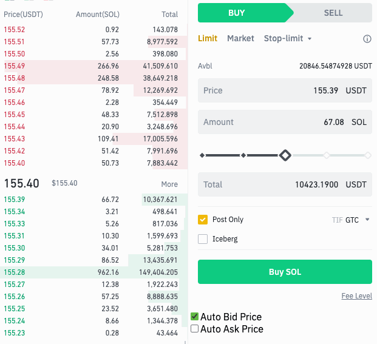

# Binance Auto Limit Price

Binance Auto Limit Price will change price and amount to current highest/lowest order market price.

For example, Lowest ask position is 1.1223 this script will help you to set the limit price to lower/upper 1 step (1.1224) to be the first order match.

Note: This script only works for Pro Layout

## How to use

1. Install Tampermonkey Browser Extension
2. Import app.js to it
3. Open Binance trade app you'll see `Auto Buy Price` and `Auto Sell Price` in Binance Pro Layout

## Screenshot

